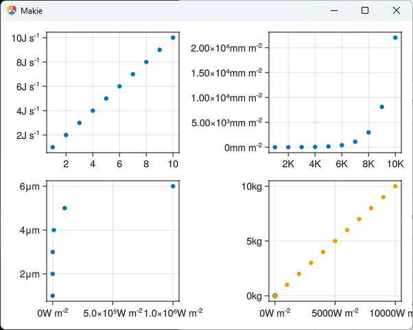

### [Add second example to "boxes around subfigures how-to page"](https://github.com/MakieOrg/Makie.jl/pull/4578)
An additional example has been added to the "boxes around subfigures" how-to page to enhance the documentation.

### [Don't force triangle mesh in crossbar with notch to avoid CairoMakie artifacts](https://github.com/MakieOrg/Makie.jl/pull/4587)
The code now avoids creating triangle meshes in crossbars with notches to prevent seam artifacts in CairoMakie.

### [Fix 2D assumption in point-based convert_args for lines](https://github.com/MakieOrg/Makie.jl/pull/4585)
This change removes the 2D assumption, enabling 3D polygons to be plotted via `lines` and `scatter` functions.

### [Fix Axis3 frameline z-sorting in CairoMakie](https://github.com/MakieOrg/Makie.jl/pull/4591)
Corrects the z-sorting for Axis3 framelines in CairoMakie by adjusting translations specifically for CairoMakie.

### [Bump codecov/codecov-action from 4 to 5](https://github.com/MakieOrg/Makie.jl/pull/4596)
Updated the codecov/codecov-action to version 5 to leverage the new Codecov Wrapper.

### [Add an example of using jupyter-server-proxy with WGLMakie](https://github.com/MakieOrg/Makie.jl/pull/4577)
An example demonstrating the use of jupyter-server-proxy with WGLMakie has been added to the documentation.

### [CompatHelper: bump compat for StructArrays to 0.7, keeping existing compat](https://github.com/MakieOrg/Makie.jl/pull/4595)
The compatibility entry for the `StructArrays` package has been updated to include version 0.7, while maintaining prior compatibility.

### [Prevent more default actions when canvas has focus](https://github.com/MakieOrg/Makie.jl/pull/4602)
The update stops certain default actions when the canvas is in focus, addressing issues such as losing focus when arrow keys are pressed.

### [Improve performance of project_line_points](https://github.com/MakieOrg/Makie.jl/pull/4601)
Significantly improved the performance of the `project_line_points` function in CairoMakie, reducing allocation and execution time.

### [Fix uint16 overflow for over ~65k elements in picking](https://github.com/MakieOrg/Makie.jl/pull/4604)
The picking functionality now correctly handles cases with more than 65,000 elements by fixing a uint16 overflow issue.

### [Fix Vararg comment](https://github.com/MakieOrg/Makie.jl/pull/4621)
A minor fix to a Vararg comment for improved code clarity.

### [Add informative error if invalid side is used for violin](https://github.com/MakieOrg/Makie.jl/pull/4612)
Adds an error message clarification when an invalid side is specified for a violin plot, avoiding silent fallbacks to default values.

### [Fix RPRMakie EnvironmentLight orientation](https://github.com/MakieOrg/Makie.jl/pull/4629)
The orientation of the EnvironmentLight in RPRMakie has been corrected for better accuracy and usability.

### [Fix incorrect comparison in CairoMakie line projections](https://github.com/MakieOrg/Makie.jl/pull/4631)
Addresses an issue in CairoMakie where an incorrect comparison in line projections caused rendering problems.

### [Update .JuliaFormatter.toml](https://github.com/MakieOrg/Makie.jl/pull/4636)
This update changes the `.JuliaFormatter.toml` to better suit usual code formatting practices, preventing VSCode conflicts.

### [Fix colorbuffer(axis) for px_per_unit](https://github.com/MakieOrg/Makie.jl/pull/4574)
This change addresses an unspecified issue related to `colorbuffer` and `px_per_unit`.

### [More thoroughly test session + server to figure out the problem with ...](https://github.com/MakieOrg/Makie.jl/pull/4557)
Introduces more comprehensive testing for session and server functionality to investigate a specific issue.

### [Fix misaligned colors in colorbar?](https://github.com/MakieOrg/Makie.jl/pull/4618)
Adjustments have been made to ensure colorbars built from contour plots are aligned correctly, preventing miscoloration.

### [Fix CairoMakie heatmap offsets](https://github.com/MakieOrg/Makie.jl/pull/4633)
Corrects the offset of heatmap cells in CairoMakie by adjusting pixel padding, closing gaps, and improving cell alignment.

### [Add kwarg to rotate Toggle](https://github.com/MakieOrg/Makie.jl/pull/4471)
Introduces the `orientation` keyword argument for the `Toggle` widget to allow rotation of the toggle in radians.

### [Add tool for copying refimages from previous version](https://github.com/MakieOrg/Makie.jl/pull/4506)
A new tool is introduced to facilitate the importation of reference images from previous versions of the project.

### [Only use automatic unit conversion for simple units (not compound units)](https://github.com/MakieOrg/Makie.jl/pull/4583)
Automatic unit conversion is restricted to simple units, leaving compound units unchanged to ensure accuracy.

### [Fix bounds error for wglmakie closes #3961](https://github.com/MakieOrg/Makie.jl/pull/4639)
This change resolves a bounds error specifically within the wglmakie component.

### [Maximum auto ticklabelspace](https://github.com/MakieOrg/Makie.jl/pull/4642)
Implemented an alternative method for managing the maximum auto tick label space.

### [Some conversion related fixes](https://github.com/MakieOrg/Makie.jl/pull/4599)
Implements several conversion-related fixes to enhance the robustness of the conversion mechanisms.

### [Provide suggestions for unknown kwargs passed to blocks](https://github.com/MakieOrg/Makie.jl/pull/4392)
Introduces a mechanism to provide suggestions for unknown keyword arguments passed to blocks, improving developer experience.

### [Fix exception when WGLMakie is initialized after element removal](https://github.com/MakieOrg/Makie.jl/pull/4343)
The fix checks if an element exists before initializing WGLMakie, thus preventing exceptions upon element removal.

### [Show a "Did you mean:" suggestion for thrown InvalidAttributeErrors via levenshtein distance](https://github.com/MakieOrg/Makie.jl/pull/4645)
This change introduces suggestions for InvalidAttributeErrors using Levenshtein distance for possible typos.

### [Add linkaxes to S.GridLayout and make sure limits don't reset for axis links](https://github.com/MakieOrg/Makie.jl/pull/4643)
Introduces `xaxislinks` and `yaxislinks` to `S.GridLayout` to maintain zoom states when axes are swapped.

### [Tag v0.21.17](https://github.com/MakieOrg/Makie.jl/pull/4640)
This pull request represents updating the project version to v0.21.17.

### [Add backend and update_state kwargs to show](https://github.com/MakieOrg/Makie.jl/pull/4558)
Introduces `backend` and `update_state` keyword arguments for the `show` function to simplify switching of backends without manual activation.