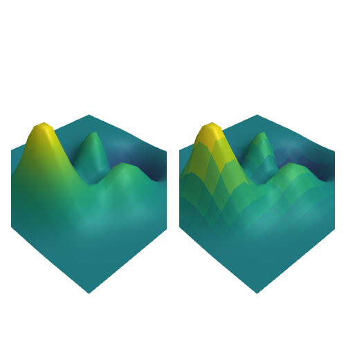
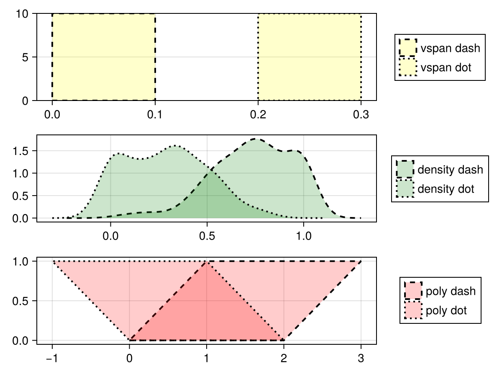
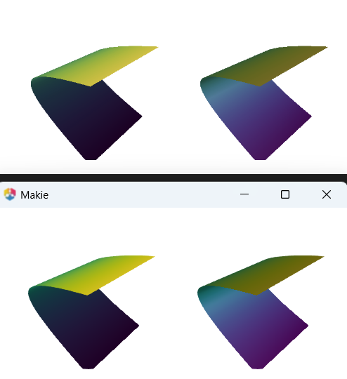
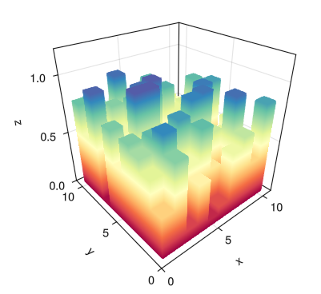

# [Fix projection from clip to data space](https://github.com/MakieOrg/Makie.jl/pull/3909)

Resolved an undefined variable issue during the projection from clip to data space and included tests for all projection space combinations.

# [Docs version picker](https://github.com/MakieOrg/Makie.jl/pull/4034)

Implemented the groundwork for a version picker in documentation using DocumenterVitepress.

# [Sort versions in picker newest to oldest](https://github.com/MakieOrg/Makie.jl/pull/4035)

Updated version sorting logic in the documentation picker to list versions from newest to oldest.

# [Resolve CairoMakie insert! ambiguity](https://github.com/MakieOrg/Makie.jl/pull/4038)

Fixed a method ambiguity error that occurred with `CairoMakie.insert!` when dealing with plot lists.

# [Fix docs, move SA to head](https://github.com/MakieOrg/Makie.jl/pull/4050)

Made minor documentation adjustments, including moving SA to the head of the document structure.

# [Fix scalar automatic lowclip/highclip](https://github.com/MakieOrg/Makie.jl/pull/4048)

Improved the handling of automatic highclip/lowclip for scalar values and added additional scalar color reference tests.

# [Fixes #4045](https://github.com/MakieOrg/Makie.jl/pull/4046)

Addressed an unspecified bug referenced as issue #4045.

# [Make the backend choice more clear](https://github.com/MakieOrg/Makie.jl/pull/4040)

Improved the clarity of backend choice communication, discussing the distinction between interactivity and vector graphics.

# [Fix stackoverflow for convert_single_argument(Any[])](https://github.com/MakieOrg/Makie.jl/pull/4051)

Fixed a stack overflow error encountered when invoking `convert_single_argument` with an empty vector.

# [Improve accuracy of set framerate in GLMakie](https://github.com/MakieOrg/Makie.jl/pull/3954)

Enhanced the accuracy of setting the framerate in GLMakie by correcting frame time discrepancies previously caused by `sleep()` function limitations.

# [Add back interpolation keyword for surface](https://github.com/MakieOrg/Makie.jl/pull/4056)

Reintroduced the `interpolation` keyword for the `surface` plot to toggle mesh interpolation on visual output.

# [Use linestyle for Poly and Density legend elements](https://github.com/MakieOrg/Makie.jl/pull/4000)

Provided a fix for correctly displaying linestyle in legend elements for Poly and Density plots, resulting in improved legend accuracy.

# [Introduce stroke_depth_shift + forward normal depth_shift for Poly](https://github.com/MakieOrg/Makie.jl/pull/4058)

Added `stroke_depth_shift` and forwarded normal `depth_shift` properties for Poly graphics to improve graphical effects.

# [Update WGLMakie docs, removing stale section that no longer applies](https://github.com/MakieOrg/Makie.jl/pull/4070)

Removed outdated sections from the WGLMakie documentation to align with the current state of the implementation.

# [Suppress keyboard shortcuts and context menu in JupyterLab output](https://github.com/MakieOrg/Makie.jl/pull/4068)

Addressed behavior related to keyboard shortcuts and the context menu, adding attributes to suppress these features in JupyterLab Makie plots.

# [Fix distance calculation in WGLMakie JS functions](https://github.com/MakieOrg/Makie.jl/pull/4082)

Corrected distance calculation to resolve erratic tooltip snapping behavior in WGLMakie plots with JavaScript improvements.

# [Fix invert_normals](https://github.com/MakieOrg/Makie.jl/pull/4021)

Resolved an issue with inverted normals and introduced a reference image test for verification.

# [Fix argument order of `save` in figure.md](https://github.com/MakieOrg/Makie.jl/pull/4088)

Adjusted the argument order for the `save` function in documentation to match expected usage.

# [Move throttle_function to Bonito](https://github.com/MakieOrg/Makie.jl/pull/3980)

Moved the `throttle_function` implementation to Bonito as part of improvements to reduce code duplication.

# [Fix stairs type to match the input](https://github.com/MakieOrg/Makie.jl/pull/4089)

Fixed an issue where types for `steppoints` in `stairs` did not match the input, preventing precision loss.

# [Move changelog to unreleased](https://github.com/MakieOrg/Makie.jl/pull/4091)

Reclassified recent changes into unreleased changelog entries to match the ongoing release cycle.

# [Fix spy and FastPixel marker](https://github.com/MakieOrg/Makie.jl/pull/4043)

Enhanced `FastPixel` to correctly adjust markersize and respect markerspace, improving usability of `spy`.

# [Improve support for embedding GLMakie](https://github.com/MakieOrg/Makie.jl/pull/4073)

Refactored GLMakie to be more embeddable with other UI libraries like CImGui and QML.jl by improving compatibility without GLFW dependency.

# [Fix meshscatter with colors](https://github.com/MakieOrg/Makie.jl/pull/4098)

Resolved an issue with improper color handling in `meshscatter` plots.

# [Fix outline for image scatter](https://github.com/MakieOrg/Makie.jl/pull/4104)

Corrected artifact issues with outlines in image scatter plots, aligning the behavior with prior adjustments made for GLMakie's rectangle outlines.

# [Update JS OrbitControls to match Julia OrbitControls](https://github.com/MakieOrg/Makie.jl/pull/4084)

Aligned the JavaScript OrbitControls implementation to match the movement and behavior of the Julia OrbitControls, enhancing camera movement consistency in WGLMakie plots.

# [Fix label/legend for plotlist](https://github.com/MakieOrg/Makie.jl/pull/4079)

Addressed a bug that caused KeyErrors when calling `axislegend()` with `plotlist` by ensuring that label data is retained.

# [Fix visible update for plots inserted after scene](https://github.com/MakieOrg/Makie.jl/pull/4100)

Ensured screen refreshes correctly after new plots are introduced into a displayed scene if they were added after the main scene creation.

# [Add information about how to set preferred axis on recipe](https://github.com/MakieOrg/Makie.jl/pull/3926)

Clarified documentation for setting preferred axes within recipes, providing a useful reference for those working with orientation-sensitive plots.

# [Fix `select_point()` from throwing an exception immediately](https://github.com/MakieOrg/Makie.jl/pull/4101)

Resolved an error in `select_point()` that caused it to throw exceptions on invocation following a user's suggestion.

# [Support alpha argument in band()](https://github.com/MakieOrg/Makie.jl/pull/3916)

Enabled functionality for the `alpha` argument in `band` plots, allowing users to achieve desired transparency effects when using CairoMakie.

# [Modify HiDPI handling to correctly operate on Wayland](https://github.com/MakieOrg/Makie.jl/pull/4062)

Improved HiDPI display handling for Wayland, aligning behavior with OSX's logic for specifying window sizes, enhancing user experience on Wayland systems.

# [Fix absrect()](https://github.com/MakieOrg/Makie.jl/pull/4110)

Resolved an ambiguity error in the `absrect()` function, ensuring reliable usage across various contexts within Makie's functionality.

# [Add clipping planes](https://github.com/MakieOrg/Makie.jl/pull/3958)

Introduced `clip_planes` attributes for up to 8 planes, allowing the user to clip 3D plots along specified axes. This addition significantly enhances 3D visualization control.

# [Fix test failures](https://github.com/MakieOrg/Makie.jl/pull/4114)

Resolved various test failures that emerged during recent development to ensure continuous integration stability without direct user-facing changes.

# [Make triangulations unique to fix refimages issues. Also tweak examples used for refimages](https://github.com/MakieOrg/Makie.jl/pull/4044)

Standardized triangulation processes during refimage creation and adjusted examples for increased consistency and reliability across Julia versions.

# [Fix GLMakie shader compatibility problems with arrays of arrays](https://github.com/MakieOrg/Makie.jl/pull/4117)

Addressed compatibility issues on certain systems by shifting clipping implementations to the geometry shader level in GLMakie.

# [Fix stackoverflow for convert_single_argument(Any[])](https://github.com/MakieOrg/Makie.jl/pull/4051)

Corrected stack overflow errors tied to the `convert_single_argument` function, augmenting feature robustness across broader use cases.

# [Require version in bug report](https://github.com/MakieOrg/Makie.jl/pull/4106)

Modified the bug report template to require users to specify package versions, facilitating easier reproduction and problem-solving.

# [Add `uv_transform` attribute to mesh, meshscatter, surface and image](https://github.com/MakieOrg/Makie.jl/pull/1406)

Implemented a `uv_transform` attribute for mesh, meshscatter, surface, and image plots to enable broader texture mapping functionality, expanding the possibilities for visual customization.

# [Add tick event](https://github.com/MakieOrg/Makie.jl/pull/3948)

Introduced a new `tick` event to better manage rendering updates and differentiate frame skips, rendering pauses, and actual frames rendered.

# [Consider model transformations in float32 conversions](https://github.com/MakieOrg/Makie.jl/pull/4026)

Investigated methods to improve precision by considering model transformations during float32 conversions within the rendering process, specifically targeting scatter markers.

# [Don't remove underlying VideoStream file when doing save()](https://github.com/MakieOrg/Makie.jl/pull/3883)

Prevented automatic deletion of the underlying `VideoStream` file upon calling `save(path, ::VideoStream)`, ensuring subsequent `show` calls are not disrupted.

# [Details for (de)activating default interactions](https://github.com/MakieOrg/Makie.jl/pull/2776)

Enhanced the documentation around activating and deactivating default interactions to aid users in understanding default settings and how to manipulate them.

# [Add position to pie (copy)](https://github.com/MakieOrg/Makie.jl/pull/4122)

Extended pie plot functionality by incorporating customizable positioning to better display subsets within pie charts.

# [Fast path for heatmap](https://github.com/MakieOrg/Makie.jl/pull/4125)

Reintroduced a performance optimization path for the `heatmap` function in cases where the heatmap is uniform and untransformed, significantly reducing data transfer overheads.

# [Sort objects in WGL as in GLMakie, nest rectanglezoom](https://github.com/MakieOrg/Makie.jl/pull/4127)

Standardized the object sorting logic in WGL to match GLMakie, resolving an issue with rectangle zoom overlay due to render order discrepancies.
