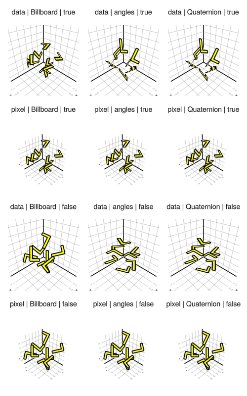
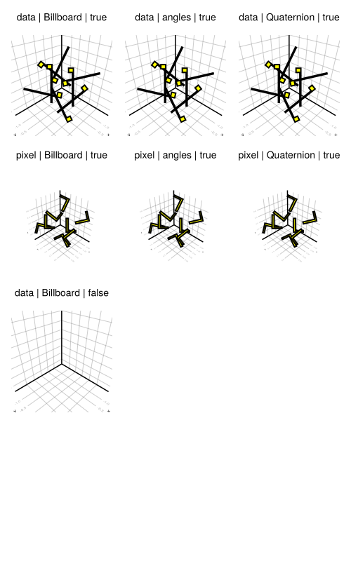
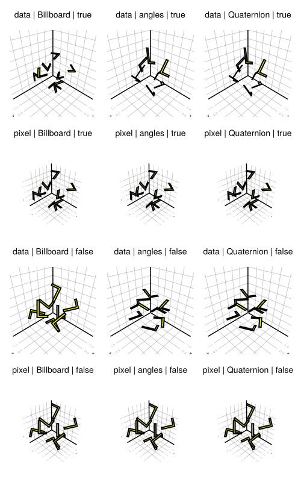

# Makie v0.22

## GeometryBasics 0.5

The largest part of this release is a refactor of GeometryBasics.
The main goal was to simplify the package, both from a user perspective and a compiler perspective. Even if you don't interact with GeometryBasics directly you should see some improvements to ttfp (specifically using and first display time).


[#173](https://github.com/JuliaGeometry/GeometryBasics.jl/pull/173), [#219](https://github.com/JuliaGeometry/GeometryBasics.jl/pull/219), [#4319](https://github.com/MakieOrg/Makie.jl/pull/4319)

### Removed meta

We removed the `meta` infrastructure used for per-vertex and per-face data in GeometryBasics. It generated a lot of type complexity, which you may have noticed before if you looked at the full type of a mesh. Instead a `GeometryBasics.Mesh` now simply holds a `NamedTuple` of array-like data, called `vertex_attributes`. Each array is interpreted as per-vertex data.

A (raw) GeometryBasics mesh is now constructed as:

```julia
# no-eval
# old_mesh = GeometryBasics.mesh(meta(positions, normals = normals, uv = uvs), faces)
new_mesh = GeometryBasics.mesh(positions, faces, normal = normals, uv = uvs)
```

Note as well that `normals` is now called `normal` to match `uv`

### FaceView

For per-face data, or more generally data which uses a different set of indices from other vertex attributes, we introduced the `Faceview` object. It contains some data and a vector of faces which replaces the meshes faces to index the data.

As an example let's look at the mesh generated for `Rect3f`, which wants per-face normals to avoid smooth shading across it's edges and corners. (`facetype` is only set to shorten the output a bit.)

```julia
# no-eval
julia> m = normal_mesh(Rect(0,0,0, 1,1,1), facetype = QuadFace{Int64})
Mesh{3, Float32, QuadFace{Int64}}
    faces: 6
    vertex position: 8
    vertex normal: 6
```

The mesh has a different number of positions and normals. If we investigate further, we find that normals are represented by a `FaceView`.

```julia
# no-eval
julia> m.normal
FaceView{Vec{3, Float32}, Vector{Vec{3, Float32}}, Vector{QuadFace{Int64}}}:
 [-1.0, 0.0, 0.0]
 [1.0, 0.0, 0.0]
 [0.0, -1.0, 0.0]
 [0.0, 1.0, 0.0]
 [0.0, 0.0, -1.0]
 [0.0, 0.0, 1.0]
```

The `FaceView` contains 6 normal vectors as data, which is shown above. The number of normals the mesh reports refers to them. The FaceView also contains 6 faces, which correspond to the 6 faces in the mesh.

```julia
# no-eval
julia> m.normal.faces
6-element Vector{QuadFace{Int64}}:
 QuadFace{Int64}(1, 1, 1, 1)
 QuadFace{Int64}(2, 2, 2, 2)
 QuadFace{Int64}(3, 3, 3, 3)
 QuadFace{Int64}(4, 4, 4, 4)
 QuadFace{Int64}(5, 5, 5, 5)
 QuadFace{Int64}(6, 6, 6, 6)
```

Each of these faces refers to just one index in `m.normal.data`, making that data apply per face.

You can convert a mesh with `FaceView`s to one without by calling `expand_faceviews(mesh)`. This will directly return the mesh if it does not contain FaceViews. Otherwise it will build a new mesh without them, remapping indices and separating faces as needed.

```julia
# no-eval
julia> expand_faceviews(m)
Mesh{3, Float32, QuadFace{Int64}}
    faces: 6
    vertex position: 24
    vertex normal: 24
```

To combine the per-face normals with positions, our mesh requires 3 copies of each position (one per face using that position) and 4 copies of each normal (one per vertex in the face). The are generated by `expand_faceviews(m)`.

Note that we also added a convenience function `face_normals(points, faces)` to GeometryBasics to generate a `FaceView` for per-face normals. In the docs you can also find an example of how to use `FaceView` to set per-face colors.

### MetaMesh & MeshIO

We have introduced a `MetaMesh` type, which allows you to bundle arbitrary data with a `GeometryBasics.Mesh`. Any data (that does not correspond to vertices or faces) can be shipped with this type. It is now used by MeshIO when loading an `obj` file that includes a material template library (i.e. an .mtl file).

```julia
# no-eval
julia> using FileIO, Makie
julia> m = load(Makie.assetpath("sponza/sponza.obj"))
MetaMesh{3, Float32, NgonFace{3, OffsetInteger{-1, UInt32}}}
    faces: 66450
    vertex position: 60848
    vertex uv: 60896
    meta: [:groups, :material_names, :materials]
```

The material data ends up in `m[:materials]` as a nested `Dict`, where the first key is the name of the material. The names are also listed in `m[:material_names]` in the same order they are referred to by the `.obj` file. The mesh contains a new `m.mesh.views` field, which marks the subset of faces affected by each material. `m[:groups]` is also synchronized with `m.mesh.views`, containing the group names of these faces.

Makie can directly plot a `MetaMesh` as it is constructed by `MeshIO`, applying the material properties it knows how to handle. This includes textures referred to by the mtl file.

```julia
# no-eval
using FileIO, GLMakie
m = load(Makie.assetpath("sponza/sponza.obj"))
f,a,p = Makie.mesh(m)
display(f)
update_cam!(a.scene, Vec3f(-15, 7, 1), Vec3f(3, 5, 0), Vec3f(0,1,0))
```

Note that Makie can currently only handle a very limited subset of the material properties an mtl file can set. As such the results may differ from what the mtl file sets and will improve in the future.


[MeshIO#98](https://github.com/JuliaIO/MeshIO.jl/pull/98), [#4368](https://github.com/MakieOrg/Makie.jl/pull/4368), [#4496](https://github.com/MakieOrg/Makie.jl/pull/4496)

## [Axis3 Controls](https://github.com/MakieOrg/Makie.jl/pull/4131)

With version 0.22 we have introduced a few new controls to Axis3:

#### Translation

The content of an Axis3 can be translated by holding the right mouse button and dragging. Any content that spills outside the frame of the axis will be clipped. Translations can be restricted to a specific dimension by holding the x, y and/or z key while translating. If `viewmode = :free` you can also translate the whole Axis3 (content + decorations) by holding left control while translating.

#### Zoom

The content of an Axis3 can be zoomed by scrolling the mouse wheel. By default zoom is focused on the center of the axis. This can be changed to be focused on the cursor by setting `ax.zoommode[] = :cursor`. Like with translations, content outside the frame is clipped and the x, y and/or z key can be used to restrict zooming to specific dimensions. If `viewmode = :free` zooming always affects the whole Axis3 (content + decorations) and is always focused on the center of the axis.

#### Limit Reset

The limit reset works similarly to Axis. By pressing left control and the left mouse button limits are reset to the previously set user limits or, if none exist, default limits. Adding left shift results in a full reset, removing user limits if any exist. In the context of Axis3, the former resets zoom and translation of axis content. The latter also resets rotation and translation of the whole Axis3. The latter can also be activated without the former by just pressing left shift and the left mouse button

#### Focus on cursor

You can center the Axis3 on the data under the cursor by pressing left alt and the left mouse button. With `zoommode = :center` (or `viewmode = :free`) this will translate that data point in such a way that you can zoom towards it without clipping into it.

## Smaller Changes

### Scatter marker_offset behavior change

In previous versions `marker_offset` was used to center scatter markers, but it could also be set by the user to specify some other offset. This was somewhat confusing as `marker_offset = Vec2f(0)` did not result in a centered marker. It also did not work with `BezierPath` markers, which have become the default.

In this release we separated the centering into an internal attribute, so that `marker_offset` is a pure user attribute. With this `marker_offset = 0` now results in the same centered marker as not specifying it would. It also now works consistently for all marker types and is no longer affected by the `rotation` attribute.
[#4594](https://github.com/MakieOrg/Makie.jl/pull/4594)

### MeshScatter transform_marker

`Scatter` has a `transform_marker::Bool` attribute which controls whether the model matrix (i.e. `translate!()`, `rotate!()`, `zoom!()`) affects the marker. `MeshScatter` now also has this attribute. It is set to `false` by default, which changes the behavior from the previous version. Most notably this will affect the shape of meshscatter objects in an Axis3. Where previously they were scaled based on the limits of the Axis they now preserve their shape and size.

[#4606](https://github.com/MakieOrg/Makie.jl/pull/4606)

### CairoMakie

We have cleaned up two rendering pipelines in CairoMakie. The first is the meshscatter/voxel/surface/mesh pipeline. It previously handled transformations incorrectly, always applying transform_func and model to (generated) mesh vertices. This is correct for `mesh` and `surface` but not `meshscatter` and `voxel`. It also didn't allow for meshes without normals.

The second is the `scatter` pipeline. It was previously built with `markerspace = :pixel` in mind, which caused various rendering issues when `markerspace != :pixel`, `transform_marker != false` and/or `rotation` was involved. These issues include silent corruption of Cairo state which causes no more plots to be drawn. These issues have now been resolved and you should get the same results from CairoMakie as you get from GLMakie and WGLMakie when these attributes are involved. (Up to some smaller differences due to perspective projection in 3D.)

| **GLMakie**                                     | **CairoMakie before**                                 | **CairoMakie after**                                  |
|-------------------------------------------------|-----------------------------------------------------|-----------------------------------------------------|
|  |  |  |


[#4606](https://github.com/MakieOrg/Makie.jl/pull/4606), [#4663](https://github.com/MakieOrg/Makie.jl/pull/4663)

## Front Spines in Axis3

Introduces an option to close an Axis3's outline box with a new `front_spines` feature, enhancing the visualization of 3D plots by drawing the box spines in front.

```julia
using GLMakie, FileIO

fig = Figure()
brain = load(assetpath("brain.stl"))
ax = Axis3(fig[1, 1], front_spines = true) # see also x/y/zspinecolor_4
mesh!(ax, brain, color = :gray80)
fig
```

[#4305](https://github.com/MakieOrg/Makie.jl/pull/4305)

## Enable curvilinear contour plots

Curvilinear contour plots are enabled using Contour.jl's capabilities, now supporting grids for more flexible contour visualizations:

```julia
using GLMakie
x = -10:10
y = -10:10
# The curvilinear grid:
xs = [x + 0.01y^3 for x in x, y in y]
ys = [y + 10cos(x/40) for x in x, y in y]
zs = sqrt.(xs .^ 2 .+ (ys .- 10) .^ 2)
levels = 0:4:20
fig, ax, srf = surface(xs, ys, fill(0f0, size(zs)); color=zs, shading = NoShading, axis = (; type = Axis, aspect = DataAspect()))
ctr = contour!(ax, xs, ys, zs; color = :orange, levels = levels, labels = true, labelfont = :bold, labelsize = 12)
fig
```

[#4670](https://github.com/MakieOrg/Makie.jl/pull/4670)

## Backlog

### Fix Screen re-opening issue

Implements screen reusability by using `empty!` instead of closing and reopening, solving a window behavior issue on Linux when reusing GLMakie's singleton screen.

[#3881](https://github.com/MakieOrg/Makie.jl/pull/3881)

### Picking improvements

Since the last breaking release we had a bunch of fixes for picking in WGMakie and GLMakie.
We added tests and also updated the indices produced by image, heatmap and surface to correspond to the matrix indices of the given data.

[#4082](https://github.com/MakieOrg/Makie.jl/pull/4082), [#4136](https://github.com/MakieOrg/Makie.jl/pull/4136), [#4137](https://github.com/MakieOrg/Makie.jl/pull/4137), [#4459](https://github.com/MakieOrg/Makie.jl/pull/4459), [#4488](https://github.com/MakieOrg/Makie.jl/pull/4488), [#4604](https://github.com/MakieOrg/Makie.jl/pull/4604)

### Tick Event

In version 0.21.6 we introduced a `events(fig).tick` event.
The event triggers once per frame in GLMakie, CairoMakie and `record()`, and on a timer in WGLMakie.
It can be used for anything that should happen synchronized with rendering, e.g. animation.
The tick event contains the number of frames rendered `tick.count`, the time since rendering started `tick.time` and the time since the last tick `tick.delta_time`.

[#3948](https://github.com/MakieOrg/Makie.jl/pull/3948)

### uv_transform

In version 0.21.6 we added the `uv_transform` attribute to `image`, `surface`, `mesh` and `meshscatter`.
It acts as a transformation matrix on texture coordinates similar to how model transforms coordinates.
The attribute accept 2x3 and 3x3 matrices (which will get truncated to 2x3), a `Symbol` for named transformations, `LinearAlgebra.I`, a `Vec2f` representing scaling, a `Tuple{Vec2f, Vec2f}` representing translation and scaling or a tuple of the containing multiple operations which will get chained (last operation applies first).
See `?Makie.uv_transform` for more information.

```julia
# no-eval
using LinearAlgebra, GeometryBasics, FileIO, GLMakie, ColorSchemes

cow = load(assetpath("cow.png"))
f = Figure()
image(f[1, 1], cow, uv_transform = :transpose)

meshscatter(
    f[2, 1], [Point2f(x, y) for x in 1:10 for y in 10:-1:1],
    color = cow,   # first (translate, scale), then :transpose
    uv_transform = [(:transpose, (Vec2f(x, y), Vec2f(0.1, 0.1))) for x in 0.0:0.1:0.9 for y in 0.0:0.1:0.9],
    markersize = Vec3f(0.9, 0.85, 1),
    marker = uv_normal_mesh(Rect2f(-0.5, -0.5, 1, 1))
)

texture = reshape(get(colorschemes[:Spectral_11], 0:0.01:1), 101, 1)

# create fitting mesh
r = Rect3f(Point3f(-0.5, -0.5, 0), Vec3f(1, 1, 1))
uvs = [Vec2f(p[3], 0) for p in coordinates(r)]
rect_mesh = GeometryBasics.mesh(r, normal = normals(r), uv = uvs)

z = rand(10,10)
meshscatter(
    f[1:2, 2], [Point3f(i, j, 0) for i in 1:10 for j in 1:10],
    markersize = Vec3f.(1, 1, 10z[:]),
    uv_transform = Vec2f.(z[:], 1), # scale only
    marker = rect_mesh, color = texture, shading = NoShading
)
f
```

[#1406](https://github.com/MakieOrg/Makie.jl/pull/1406)

### Line Loops

After reworking our line shaders in 0.21 we added code for rendering closed line loops in version 0.21.4.
If the start and end point of a line is the same and it has at least 4 points, it is detected as a loop.
In that case the line doesn't draw a linecap at the start and end point, but instead another joint, closing the loop.

[#3907](https://github.com/MakieOrg/Makie.jl/pull/3907)
